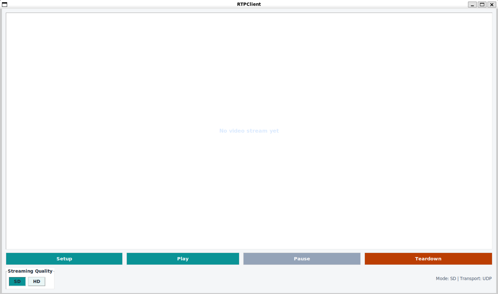
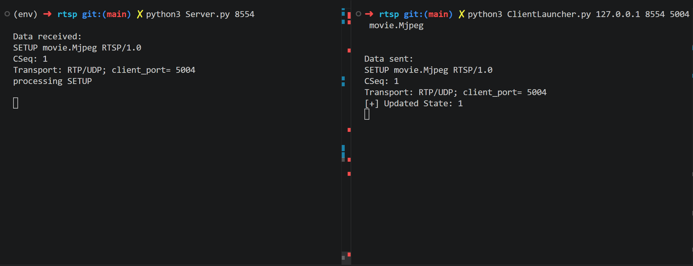
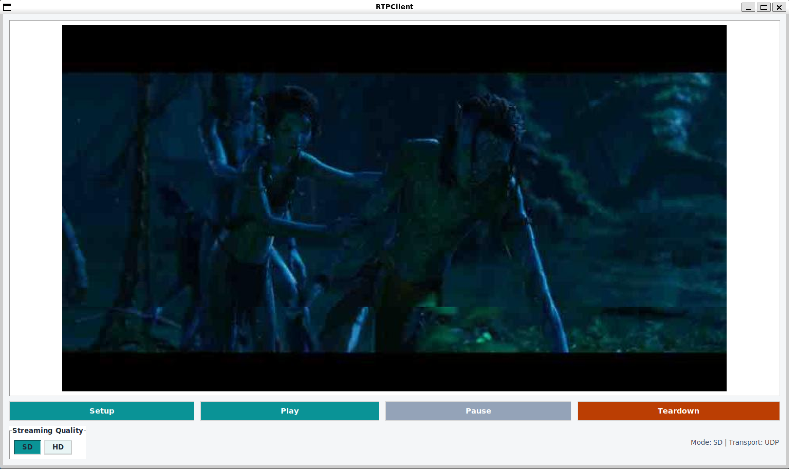
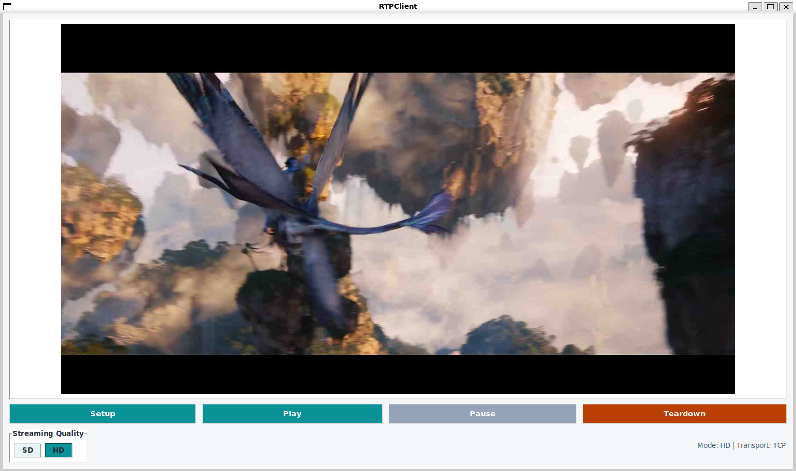

# RTSP/RTP Video Streaming - Lab Report
**Student:**
1. 23120004 - Nguyễn Trọng Doanh
1. 23120052 - Nguyễn Lê Khánh
1. 23120054 - Trần Đăng Khoa

---

## Table of Contents

1. [Introduction](#1-introduction)
2. [System Architecture](#2-system-architecture)
3. [Base Skeleton and Assignment Scope](#3-base-skeleton-and-assignment-scope)
4. [Implemented Features](#4-implemented-features)
   - 4.1 [RTSP Protocol in Client and RTP Packetization in Server](#41-rtsp-protocol-in-client-and-rtp-packetization-in-server)
   - 4.2 [UDP Transport and Frame Fragmentation](#42-udp-transport-and-frame-fragmentation)
   - 4.3 [I/O Multiplexing with epoll](#43-io-multiplexing-with-epoll)
   - 4.4 [HD Video Streaming with TCP](#44-hd-video-streaming-with-tcp)
   - 4.5 [Client-Side Caching and SD/HD Switching](#45-client-side-caching-and-sdhd-switching)
5. [How to Run](#5-how-to-run)
6. [Demo Screenshots](#6-demo-screenshots)
7. [Testing and Validation](#7-testing-and-validation)
8. [Conclusion](#8-conclusion)

---

## 1. Introduction

This project implements a video streaming system controlled by **RTSP** and delivered using **RTP**.

- **RTSP (Real Time Streaming Protocol)** is used as the control channel over TCP. It manages the streaming session through commands such as `SETUP`, `PLAY`, `PAUSE`, `TEARDOWN`, and the custom flow-control command `PACE`.
- **RTP (Real-time Transport Protocol)** is used to carry MJPEG video data. The project supports RTP over UDP for SD streaming and RTP over TCP for HD streaming.

The assignment required implementing the RTSP protocol in the client, RTP packetization in the server, UDP fragmentation for large frames, I/O multiplexing, HD streaming over TCP, and client-side caching with SD/HD switching. The final implementation extends the provided skeleton into a more complete streaming application with adaptive transport selection and buffering.

---

## 2. System Architecture

```
+---------------------------------+       +----------------------------------+
|             CLIENT              |       |              SERVER              |
|                                 |       |                                  |
|  ClientLauncher.py              |       |  Server.py                       |
|      -> Client.py               |       |      -> ServerWorker.py          |
|           - Tkinter GUI         |       |           - RTSP state machine   |
|           - RTSP sender         |       |           - VideoStream          |
|           - RTP receiver        |       |           - RTP sender worker    |
|           - Frame buffer        |       |           - UDP/TCP handlers     |
|                                 |       |                                  |
|  RTSP control socket            | TCP   |  RTSP listen socket              |
|  SETUP/PLAY/PAUSE/TEARDOWN      | <-->  |  epoll monitors client sockets   |
|                                 |       |                                  |
|  RTP receive socket             | UDP   |  RTP send socket                 |
|  SD tiled stream                | <---- |  SD frame -> JPEG tiles          |
|                                 |       |                                  |
|  RTP receive socket             | TCP   |  RTP send socket                 |
|  HD full-frame stream           | <---- |  HD frame -> full RTP packet     |
+---------------------------------+       +----------------------------------+
```

**Main data flow:**

1. The client opens a persistent RTSP/TCP connection to the server.
2. The client sends `SETUP`, including the selected media transport (`RTP/UDP` or `RTP/TCP`) and the client RTP port.
3. The server prepares the requested SD/HD streams, creates the corresponding media socket handler, and replies with `200 OK` and a session ID.
4. The client sends `PLAY`.
5. The server sends RTP packets every 50 ms.
6. The client receives RTP packets, decodes them, buffers frames, and renders them in the Tkinter GUI.
7. `PAUSE` stops the current media sender. `TEARDOWN` closes the session resources.

**Important file roles:**

| File | Role |
|------|------|
| `Server.py` | Server entry point; uses `select.epoll()` to monitor the RTSP listen socket and connected client sockets. |
| `ServerWorker.py` | Per-client RTSP state machine; prepares SD/HD streams; sends RTP over UDP or TCP. |
| `VideoStream.py` | Reads the custom MJPEG format: 5-byte ASCII frame length followed by JPEG payload. |
| `RtpPacket.py` | Encodes/decodes the 12-byte RTP fixed header and payload. |
| `Client.py` | GUI, RTSP request generation, RTP receiving, frame buffering, tile reconstruction, and SD/HD switching. |
| `ClientLauncher.py` | Parses command-line arguments and starts the Tkinter application. |
| `utils/ConvertVideo.py` | Converts MP4 or MJPEG files into the custom MJPEG format used by the project. |

---

## 3. Base Skeleton and Assignment Scope

The original skeleton already provided the overall client/server structure and some helper methods. In particular:

- `VideoStream.py` could read the custom MJPEG file format.
- `RtpPacket.py` had RTP parsing helpers, but `encode()` still had to be implemented.
- `Client.py` contained the GUI and placeholders for RTSP request handling, state transitions, and RTP socket setup.
- `ServerWorker.py` contained the basic server-side RTSP interaction for a single UDP stream, but it was later extended for transport switching, tiled fragmentation, TCP streaming, and flow control.
- `Server.py` used a blocking `accept()` loop, which was replaced by an `epoll`-based event loop for multi-client RTSP control.

The implementation therefore focuses on both the base requirements and the advanced parts from the rubric.

---

## 4. Implemented Features

### 4.1 RTSP Protocol in Client and RTP Packetization in Server

#### RTSP client-side state machine

The client maintains the three RTSP states required by the lab:

```
        SETUP          PLAY
  INIT ------> READY --------> PLAYING
                 ^                |
                 |                |
                 +------ PAUSE ---+

  TEARDOWN closes the session and returns the client to INIT.
```

The client creates RTSP requests in `sendRtspRequest()` in `Client.py`. Each request includes a `CSeq` header, and all requests after `SETUP` include the `Session` header returned by the server.

Example request flow:

```text
SETUP movie.Mjpeg RTSP/1.0
CSeq: 1
Transport: RTP/UDP; client_port= 5004

PLAY movie.Mjpeg RTSP/1.0
CSeq: 2
Session: 482910

PAUSE movie.Mjpeg RTSP/1.0
CSeq: 3
Session: 482910

TEARDOWN movie.Mjpeg RTSP/1.0
CSeq: 4
Session: 482910
```

`parseRtspReply()` updates the client state only when the reply `CSeq` matches the latest normal RTSP request. This prevents custom `PACE` replies from interfering with the main playback state.

#### RTP packet encoding

`RtpPacket.encode()` was completed to pack the RTP fixed header into 12 bytes:

```python
header[0] = ((version & 0x03) << 6) | ((padding & 0x01) << 5) \
          | ((extension & 0x01) << 4) | (cc & 0x0F)
header[1] = ((marker & 0x01) << 7) | (pt & 0x7F)
header[2] = (seqnum >> 8) & 0xFF
header[3] = seqnum & 0xFF
header[4] = (timestamp >> 24) & 0xFF
header[5] = (timestamp >> 16) & 0xFF
header[6] = (timestamp >> 8) & 0xFF
header[7] = timestamp & 0xFF
header[8] = (ssrc >> 24) & 0xFF
header[9] = (ssrc >> 16) & 0xFF
header[10] = (ssrc >> 8) & 0xFF
header[11] = ssrc & 0xFF
```

The server calls `makeRtp()` with:

- RTP version: `2`
- payload type: `26` for MJPEG
- sequence number: current frame number
- timestamp: generated from Python's `time()`
- payload: either one JPEG tile in SD/UDP mode or one complete JPEG frame in HD/TCP mode

One implementation detail is that the SSRC field is reused as lightweight metadata: in UDP tile mode it carries the tile index, and in TCP mode it carries the payload length for stream framing. This keeps the packet format simple for the lab project, although a production RTP implementation would normally use an extension header or a separate application header instead of overloading SSRC.

---

### 4.2 UDP Transport and Frame Fragmentation

#### Motivation

RTP over UDP is used for SD streaming because UDP is low-latency and does not block on retransmission. This is suitable for real-time video, where a late frame is often worse than a partially degraded frame.

However, a complete MJPEG frame can be much larger than the Ethernet MTU. Sending a large frame in one UDP datagram can trigger IP fragmentation, and losing any IP fragment makes the entire datagram unusable.

#### Tiled fragmentation

To avoid sending each SD frame as one oversized datagram, the server splits each frame into an **8 x 8 grid** of 64 independent JPEG tiles. Each tile is sent as a separate RTP/UDP packet.

Server-side logic in `_sendTiledFrame()`:

```python
img = Image.open(BytesIO(jpeg_bytes))
w, h = img.size
tile_w = w // GRID_N
tile_h = h // GRID_M

for idx in range(NUM_TILES):
    col = idx % GRID_N
    row = idx // GRID_N
    box = (col * tile_w, row * tile_h, (col + 1) * tile_w, (row + 1) * tile_h)
    tile = img.crop(box)
    buf = BytesIO()
    tile.save(buf, format='JPEG')
    pkt = self.makeRtp(buf.getvalue(), frameNumber, idx)
    self.clientInfo['rtpSocketHandler'].sendData(pkt)
```

This significantly reduces packet size compared with sending a full frame at once. The exact tile packet size still depends on image complexity and JPEG quality, but the approach greatly reduces the chance of large IP fragmentation.

#### Client-side tile reconstruction

The client collects tiles belonging to the same sequence number. When the next frame begins, or when all 64 tiles arrive, the previous frame is composed into one image.

Missing tile handling:

- If a tile was received for the current frame, it is decoded and pasted into the canvas.
- If a tile is missing but was received in a previous frame, `lastTiles` is used as a fallback.
- If no previous tile exists, that grid position remains black.
- Frames with fewer than `MIN_TILES_TO_RENDER = 48` tiles are dropped as too incomplete.

This gives graceful degradation under packet loss: instead of losing an entire frame, the client can reuse old tiles only where packets were missing.

Late UDP packets are also handled. If a tile arrives after the frame was already composed but is still waiting in the render queue, `_patchPendingFrame()` updates the queued image under a lock.

---

### 4.3 I/O Multiplexing with epoll

The original server accepted one client at a time in a blocking loop. This was replaced by an `epoll` event loop in `Server.py`.

The server now:

1. Registers the RTSP listen socket with `epoll`.
2. Accepts new client connections without blocking the whole server.
3. Registers each client RTSP socket for read events and hangup/error events.
4. Maintains a text buffer per client socket so partial RTSP messages can be reassembled.
5. Dispatches complete RTSP requests to the corresponding `ServerWorker`.
6. Cleans up client resources on disconnect, error, or teardown.

Simplified structure:

```python
epoll = select.epoll()
epoll.register(rtspSocket.fileno(), select.EPOLLIN)

while True:
    for fd, event in epoll.poll(1):
        if fd == rtspSocket.fileno():
            conn, addr = rtspSocket.accept()
            conn.setblocking(False)
            workers[conn.fileno()] = ServerWorker({'rtspSocket': (conn, addr)})
            epoll.register(conn.fileno(), select.EPOLLIN | select.EPOLLHUP | select.EPOLLERR)
        elif event & select.EPOLLIN:
            chunk = sock.recv(4096)
            buffers[fd] += chunk.decode('utf-8', errors='ignore')
            requests, buffers[fd] = _extract_rtsp_requests(buffers[fd])
            for req in requests:
                keep_alive = workers[fd].processRtspRequest(req)
        elif event & (select.EPOLLHUP | select.EPOLLERR):
            _cleanup_client(fd, ...)
```

This means the **RTSP control plane** is multiplexed in one server event loop. The media path still uses a per-active-session RTP sender worker thread so that media sending does not block the RTSP control loop.

---

### 4.4 HD Video Streaming with TCP

#### Motivation

HD video is larger and more sensitive to packet loss. For HD streaming, the project uses RTP over TCP. TCP provides reliable in-order delivery, which avoids the visible corruption or complete frame loss that can happen when large UDP packets are lost.

#### Polymorphic socket handlers

Both client and server use a common socket-handler interface:

| Handler | Transport | Main use |
|---------|-----------|----------|
| `socketUDPHandler` | UDP datagram | SD tiled RTP stream |
| `socketTCPHandler` | TCP stream | HD full-frame RTP stream |

The client chooses transport based on the GUI radio button:

- SD -> `Transport: RTP/UDP`
- HD -> `Transport: RTP/TCP`

During `SETUP`, the server reads the `Transport` header and creates the corresponding media socket handler.

#### TCP stream framing

TCP is a byte stream, so a single `recv()` call does not necessarily return one full RTP packet. The client-side TCP handler therefore buffers bytes until a complete RTP packet is available.

In this project, the server stores `len(payload)` in the RTP SSRC field for TCP packets. The client first reads the 12-byte RTP header, extracts the payload length, and then waits until the full payload has arrived.

```python
def recvData(self, max_size):
    self._fill(RTP_HEADER_SIZE, max_size)
    h = self.recv_buffer
    payload_len = (h[8] << 24) | (h[9] << 16) | (h[10] << 8) | h[11]
    total_len = RTP_HEADER_SIZE + payload_len
    self._fill(total_len, max_size)
    packet = bytes(self.recv_buffer[:total_len])
    del self.recv_buffer[:total_len]
    return packet
```

With this wrapper, the rest of the client can treat TCP and UDP similarly: `listenRtp()` receives exactly one RTP packet per call.

---

### 4.5 Client-Side Caching and SD/HD Switching

#### Frame buffer and pre-roll

The client uses a bounded `queue.Queue` between the RTP receiver thread and the Tkinter render loop.

| Parameter | Value | Purpose |
|-----------|-------|---------|
| `frameBufferSize` | 100 frames | Bounded producer/consumer buffer. |
| `preRollTarget` | 15 frames | Number of frames to accumulate before first rendering after `PLAY`. |
| `renderTickMs` | 50 ms | Around 20 fps render cadence. |
| `highWaterMark` | 90 frames | Start flow-control pause when the buffer is nearly full. |
| `lowWaterMark` | 60 frames | Resume server sending after the buffer drains. |

The producer side receives RTP packets and calls `_enqueuePayload()`. The consumer side is `_renderTick()`, scheduled by Tkinter with `master.after()`. If the buffer temporarily underflows, the GUI simply keeps showing the previous frame instead of flashing or crashing.

#### PACE flow control

When the buffer becomes too full, the client sends a custom RTSP control message:

```text
PACE PAUSE RTSP/1.0
CSeq: -1
Session: 482910
```

The server receives this in `ServerWorker.processRtspRequest()` and clears `flowEvent`. The RTP sender checks this event before sending the next frame. When the buffer drains to the low-water mark, the client sends:

```text
PACE RESUME RTSP/1.0
CSeq: -2
Session: 482910
```

Negative `CSeq` values are used so `PACE` replies do not collide with the normal RTSP request sequence. Writes to the RTSP socket are protected by `rtspLock`, because both the GUI thread and the RTP receiver thread may send control messages.

#### SD/HD profile switching

The GUI has two modes:

- **SD**: uses UDP and tiled RTP packets.
- **HD**: uses TCP and full-frame RTP packets.

When the user changes quality, the client sends another `SETUP` request with the new transport. If the stream was already playing, `wasPlayingBeforeSetup` is set so that the client returns to `PLAYING` after the server confirms setup.

On the server, switching profile performs these steps:

1. Stop the current RTP sender thread.
2. Destroy the old UDP/TCP media socket handler.
3. Create the new handler for the selected transport.
4. Synchronize the SD and HD `VideoStream` instances to the same frame index.
5. Restart the RTP sender if the client was playing.

Timeline synchronization is handled with:

```python
def _sync_profile_streams(self):
    streams = self.clientInfo.get('videoStreams')
    if not streams:
        return
    target = max(stream.frameNbr() for stream in streams.values())
    for stream in streams.values():
        stream.seekFrame(target)
```

The client also resets in-progress tile state on each new `SETUP`, preventing stale UDP tiles from being mixed into the new stream. The main frame buffer is preserved, so already queued frames may still be displayed briefly during a profile switch. This avoids a black gap and keeps playback continuous while the new transport starts delivering frames.

---

## 5. How to Run

### Environment

Because the server uses `select.epoll()`, run it on Linux or WSL.

Create virtual environment and install dependencies:

```bash
python3 -m venv env
source ./env/bin/activate
pip install pillow opencv-python
```

`tkinter` is also required for the client GUI. On many Python installations it is bundled by default; on Linux it may need to be installed through the system package manager.

### Prepare video assets

The server maps a requested file name such as `movie.Mjpeg` to two profile files:

```text
SD_movie.Mjpeg
HD_movie.Mjpeg
```

Therefore, before running the SD/HD version, make sure both profile files exist in the project root.

#### Quick setup
For a quick protocol-only smoke test, the provided `movie.Mjpeg` can be copied to both profile names:

```bash
cp movie.Mjpeg HD_movie.Mjpeg
cp movie.Mjpeg SD_movie.Mjpeg
```

#### Thorough setup
From a source MP4 ([here](https://drive.google.com/file/d/1ThbwnZQ1Myu4ekZtfKXnhiGzR5Ts2Dbe/view?usp=sharing)):

```bash
python3 utils/ConvertVideo.py --mode mp4_to_mjpeg \
  --input source.mp4 --output HD_movie.Mjpeg --quality 25

python3 utils/ConvertVideo.py --mode mp4_to_mjpeg_480p \
  --input source.mp4 --output SD_movie.Mjpeg --quality 25
```

This copy-based shortcut is only for testing startup and RTSP/RTP behavior; it does not demonstrate true HD/SD quality difference.

### Start the server

```bash
python3 Server.py 8554
```

### Start the client

Open another terminal:

```bash
python3 ClientLauncher.py 127.0.0.1 8554 5004 movie.Mjpeg
```

Arguments:

| Argument | Example | Meaning |
|----------|---------|---------|
| Server host | `127.0.0.1` | Address of the RTSP server. |
| Server port | `8554` | RTSP/TCP port used by `Server.py`. |
| RTP port | `5004` | Client-side media port. |
| Video file | `movie.Mjpeg` | Logical request name; server opens `SD_movie.Mjpeg` or `HD_movie.Mjpeg`. |

### GUI usage

1. Click **Setup**.
2. Click **Play**.
3. Select **SD** for UDP tiled streaming or **HD** for TCP full-frame streaming.
4. Click **Pause** to pause playback.
5. Click **Teardown** to close the session.

---

## 6. Demo Screenshots

This section is reserved for demo images and screenshots. Replace the placeholder image paths below with the actual screenshots used in the presentation or live demo.

### 6.1 Startup

The RTSP server running and listening for client connections.

The RTSP client runs and user click `SETUP`.





### 6.2 SD Streaming over UDP

The frame is split into UDP/RTP tiles and reconstructed on the client side. If some tiles don't arrive before render time, we use the previous tile to fill it, so there are some glitches.



### 6.3 HD Streaming over TCP

Full MJPEG frames are transported over the TCP media path.




### 6.4 SD/HD Switching and Buffering

Add screenshots showing quality switching during playback and, if available, buffer or flow-control logs such as `PACE PAUSE` and `PACE RESUME`.

Switch from SD to HD (UDP to TCP):

Client log:
```
Data sent:
SETUP movie.Mjpeg RTSP/1.0
CSeq: 3
Transport: RTP/TCP; client_port= 5004
```

Server log:
```
Data received:
SETUP movie.Mjpeg RTSP/1.0
CSeq: 3
Transport: RTP/TCP; client_port= 5004
processing SETUP
```

---

## 7. Testing and Validation

The following test cases were used to verify the implementation against the assignment requirements.

| Requirement | Test | Expected result |
|-------------|------|-----------------|
| RTSP client protocol | Click `Setup -> Play -> Pause -> Teardown`. | Client sends valid RTSP requests with increasing `CSeq`; server replies `200 OK`; client state changes correctly. |
| RTP packetization | Start streaming and decode packets on the client. | RTP version is 2, payload type is 26, sequence numbers increase with frame number, and payload renders as MJPEG. |
| UDP fragmentation | Run SD mode. | Server sends 64 RTP/UDP tile packets per frame; client reconstructs frames from tiles. |
| Packet-loss concealment | Drop or delay some UDP packets during SD mode. | Missing tiles are filled from previous tiles when available; incomplete frames below the threshold are dropped. |
| I/O multiplexing | Start more than one client against the same server. | Server accepts multiple RTSP clients through the `epoll` loop instead of blocking at the first connection. |
| HD over TCP | Select HD mode and play. | Client receives full-frame RTP packets over TCP and reconstructs packet boundaries using the payload length convention. |
| Client-side caching | Start playback after `PLAY`. | Rendering begins after pre-roll; buffer smooths short arrival jitter. |
| SD/HD switching | Change the radio button during playback. | Client sends a new `SETUP`; server switches transport/profile and synchronizes stream frame indexes. |
| Flow control | Let the buffer approach the high-water mark. | Client sends `PACE PAUSE`; server pauses RTP sending until `PACE RESUME`. |

---

## 8. Conclusion

This project completes the base RTSP/RTP video streaming lab and adds the advanced features required by the rubric.

The final system implements:

1. **RTSP client control and RTP server packetization** - the client sends valid RTSP requests, and the server wraps MJPEG data into RTP packets.
2. **UDP frame fragmentation** - SD frames are split into 8 x 8 JPEG tiles, reducing large datagrams and allowing partial frame recovery.
3. **I/O multiplexing** - the server uses `epoll` for RTSP control sockets and can handle multiple client connections without a blocking accept loop.
4. **HD streaming over TCP** - HD mode sends complete RTP/MJPEG frames over a reliable TCP media path with explicit stream framing.
5. **Client-side caching and adaptive switching** - the client uses pre-roll, a bounded frame buffer, PACE flow control, and SD/HD profile switching to make playback smoother.

Overall, the implementation addresses the main networking problems in the assignment: control-message reliability, RTP header construction, UDP MTU limitations, multi-client control handling, TCP byte-stream framing, buffering, and mid-stream quality switching.
